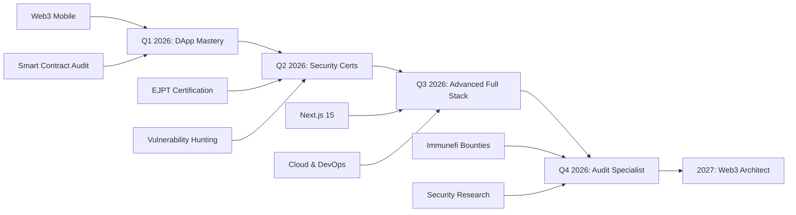

# 👋 Hola, soy Omar (@omidev)


<div align="center">
  
</div>

<h3 align="center">🌟 Transforming Ideas into Secure Code | Innovating in Web3 🌟</h3>

<div align="center">
  
  
  
</div>

<br>


## 🚀 **Sobre Mí**

```typescript
const Omar = {
    username: "omidev",
    location: "🌍 La Paz, Bolivia",
    currentFocus: ["DeFi", "Smart Contracts", "Cybersecurity"],
    workingOn: "Building the next generation of secure dApps",
    learning: ["Rust", "Move", "Advanced Cryptography"],
    askMeAbout: ["Solidity", "React", "Ethical Hacking", "Blockchain"],
    funFact: "I debug smart contracts and hunt vulnerabilities for fun! 🐛🔍",
    goals2026: "Contribute to major DeFi protocols & scale my dApps",
    motto: "Code with purpose, secure by design 🔐"
};
```

### 🎯 **Especialidades**

- 🔗 **Blockchain Development** - Smart Contracts, DeFi, Web3
- 🛡️ **Cybersecurity** - Penetration Testing, Vulnerability Assessment
- 💻 **Full Stack Development** - React, TypeScript, Node.js
- 🌐 **Network Security** - LAN/WAN Management, Security Protocols

## 🛠️ **Tech Arsenal**

<details open>
<summary><b>🌐 Blockchain & Web3</b></summary>
<br>


</details>

<details open>
<summary><b>💻 Languages & Frameworks</b></summary>
<br>


</details>

<details open>
<summary><b>🔒 Cybersecurity & Tools</b></summary>
<br>


</details>

---

## 📊 **GitHub Analytics**

<div align="center">


</div>

<div align="center">

</div>


## 📈 **Roadmap 2026-2027**

## 📈 **Roadmap 2026-2027**



## 🔥 **Skills in Action**

<details>
<summary><b>🔐 Security-First Approach</b></summary>
<br>

- **Secure by Design**: Cada línea de código se diseña pensando en la seguridad.
- **Threat Modeling**: Análisis proactivo de vectores de ataque.
- **Smart Contract Audits**: Auditorías especializadas en Solidity y Motoko.

</details>

<details>
<summary><b>⚡ Metodologías Ágiles</b></summary>
<br>

- **DevSecOps**: Integración de seguridad en el ciclo CI/CD.
- **TDD (Test Driven Development)**: Desarrollo orientado a pruebas rigurosas.
- **Code Quality**: Uso de herramientas automatizadas de métricas de calidad.

</details>

## 🌐 **Connect With Me**

<div align="center">

[](https://linkedin.com/in/your-profile)
[](https://twitter.com/your-username)
[](https://t.me/your-username)
[](https://discord.gg/your-username)
[](mailto:your-email@gmail.com)
[](https://your-portfolio.com)

### 📧 **Para Colaboraciones**
> **Blockchain Development** • **Security Audits** • **Technical Consulting** • **Code Reviews**

</div>

<br>

<div align="center">
  
</div>

<div align="center">
  
</div>

<div align="center">
  
</div>
